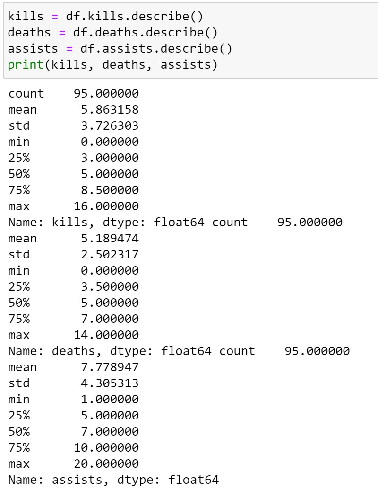

# League of Legends Azir Soloq (Patch 10.7 - 10.13) Analysis: Project Overview

* Collect raw data from Riot API and transcribe it into more easily manipulable dataframe.
* Look at some basic stats and drawing a personal conclusion about the champion and how I play the champion
* https://na.op.gg/summoner/userName=%C3%ACrelia

# Code and Resources Used
**Python Version:** 3.7

**Packages:** pandas, matplotlib, riotwatchers

**Riot API Wrapper Used:** https://riot-watcher.readthedocs.io/en/latest/

**Using Riot API Article:** https://towardsdatascience.com/how-to-use-riot-api-with-python-b93be82dbbd6

**Data Dragon Riot API Library:** https://riot-api-libraries.readthedocs.io/en/latest/ddragon.html

# Data Collection
Used RiotWatcher wrapper (above) to collect data from Riot API. Data include but are not limited to:
* TeamId  
* ParticipantId
* Champion 
* Role
* Lane
* Summoner Spells
* Items
* Wins
* Kills
* Deaths
* Assists
* etc...

Also converted Id to names of its corresponding champion, rune, and item names using DDragon (above)

# Data Cleaning
After collecting a total of ~100 games yielding 1000 rows (10 players per game) I made the following changes to narrow the csv file down to only rows containing games where I played Azir. Changes made include:
* Changed Unnamed: 0 column to summonerId
* Parsed out only the summoner name
* Located and kept only rows where summonerId was myself and champion played was Azir

# Exploratory Data Analysis
Most stats were fairly clean and needed minimal editing. Looked deeper into combined stats using mostly value_counts() and describe().
Here is a simple snapshot of what I have found (only applies to me, how I pilot this champion, and some personal statistics).

* 93/95 games I went Teleport

* 65/95 games I went Conqueror

* Majority of games staples purchased items include Nashor's Tooth, Zhonya's, Morellonomicon, Sorcer's Shoes

I seems to be looking like I am fixed on the way I play. I choose same summoner spells, keystones, and items majority of the time. Perhaps if I be alittle more flexible to specific matchups or try variations on builds, runes, and spells I may yield different results.

Over 95 games I average 5.8 kills per game, 7.8 assists per game, and 5.2 deaths per game. There is nothing definitive to say solely based of this alone.

On average I earn about 11,500 gold (~4 items) while only dealing around 20,000 damage. To myself a good damage per minute is 1000 dmg/min, in this situation I am severly underdoing my role as the mid laner because my damage in the game is so low. Especially since I can see majority of my levels are above level 13, I think game time are over 30 minutes based on what level I am.

Average wards placed at 9 seems mediocre at best for my standards.

These stats shows I have terrible map participation and influence in the early game. While true Azir is a powerhouse late game and does not contribute much early these numbers are pretty abysmal. The mean CS of 177 may seem okay but I am not for sure because I do not know average game time. Assuming average game time is around 30 minutes, my CS number could be better.

# Final thoughts

After 100 games from low Gold to Plat IV I had a wonderful time playing only Azir to see what type of player I am and how the champion suits me. I learned that I am indeed not that good at this game and this champion is very hard to pilot. My playstyle was very stale and unadaptive from game to game senario. My playstyle seem to be one dimensional and my stats reflect the poor performance. Otherwise, it would be amazing if I could revisit this when I gain some more league and coding skills. Thanks alot from a novice coder :).
